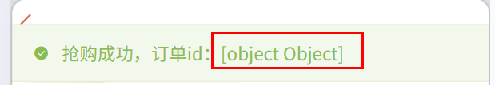
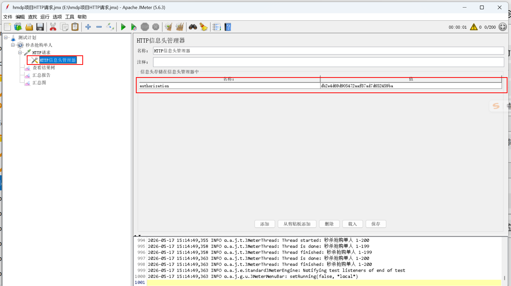
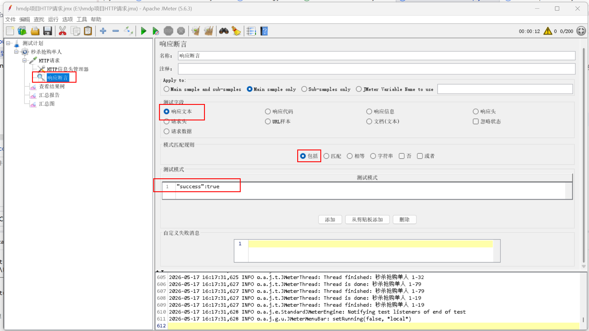
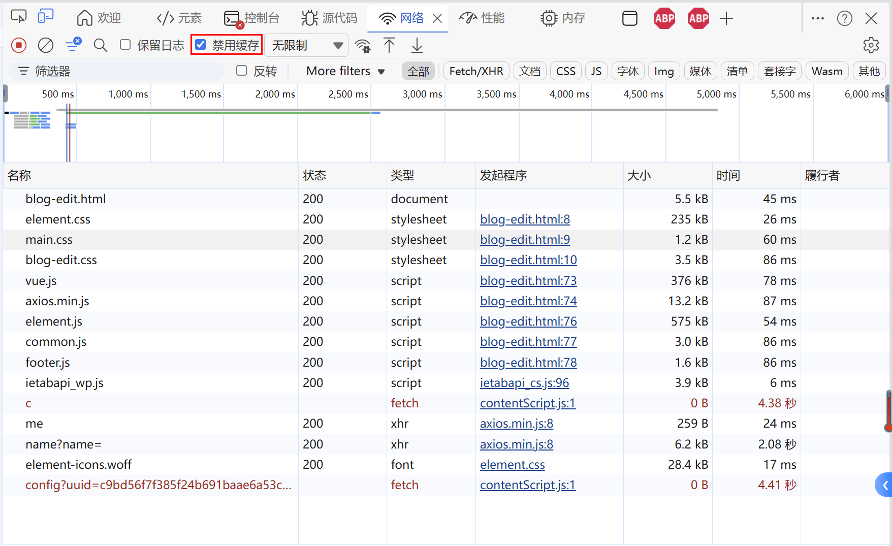

# 学习过程中参考的大佬笔记

[【Redis实战篇】黑马点评学习笔记（16万字超详细、Redis实战项目学习必看、欢迎点赞⭐收藏）_响应头的referer是什么意思-CSDN博客](https://blog.csdn.net/weixin_52152676/article/details/144680041?spm=1001.2014.3001.5506)

# 遇到的问题

## 1.数据库中文乱码问题

通过Postman调http://localhost:8081/shop接口更新店铺信息，结果保存到数据库的数据中文出现“？”乱码

> 解决：1、application.yaml文件第13行添加characterEncoding=utf8（大概率添加这个就不出现乱码问题了）
>
> ```yaml
> url: jdbc:mysql://127.0.0.1:3306/hmdp?useSSL=false&serverTimezone=UTC&characterEncoding=utf8
> ```
>
> 2.同样是application.yaml添加server.servlet.encoding相关属性
>
> ```yaml
> server:
>   port: 8081
>   servlet:
>     encoding:
>       charset: utf-8
>       enabled: true
>       force: true
> ```

## 2.秒杀优惠券功能前端的显示问题

秒杀优惠券的业务逻辑代码没有问题，浏览器能够收到返回的Voucher_Order信息，但是前端的显示出现问题。



> 解决：前端原本就是按“返回一个订单号”来写的，那后端应返回：`Result.ok(orderId)`。而不是`Result.ok(voucherOrder)`，这样前端原来的字符串拼接也能正常显示订单号。
>

## 3.JMeter测试中ResponseCode 401问题及解决

用JMeter测试抢购优惠券时所有请求都异常，查看ResponseCode均为401（未授权）。

> 解决：秒杀业务需要用户登录，因此在JMeter的HTTP信息头管理器中设置token，模拟一个用户同时发送多次下单请求。（如图所示）



此外，如果想让库存不足的情况在jmeter中显示为异常，jmeter配置修改如下（如图所示）：断言成功值："success":true 配置为：

  1. 响应文本
  2. 包含
  3. 不勾 否
  4. 模式写 "success":true



# 琐碎的小知识点

## 1.泛型

在CacheClient工具类中，我们使用了泛型。什么是泛型以及泛型的适用场景和好处是什么？

> Java 泛型就是用 `<T>`、`<E>`、`<K,V>` 这类类型占位符，让<u>类、接口、方法</u>可以适配不同类型，同时保证类型安全。

## 2.函数式接口

在CacheClient中，我们使用了有参、有返回值的函数式接口Function。还有哪些其他类型的函数式接口？

| 场景                 | 函数式接口            | 调用方法   |
| -------------------- | :-------------------- | ---------- |
| 有参有返回值         | `Function<T, R>`      | `apply()`  |
| 有参无返回值         | `Consumer<T>`         | `accept()` |
| 无参有返回值         | `Supplier<T>`         | `get()`    |
| 有参返回 boolean     | `Predicate<T>`        | `test()`   |
| 两参有返回值         | `BiFunction<T, U, R>` | `apply()`  |
| 两参无返回值         | `BiConsumer<T, U>`    | `accept()` |
| 一参一返回，类型相同 | `UnaryOperator<T>`    | `apply()`  |
| 两参一返回，类型相同 | `BinaryOperator<T>`   | `apply()`  |

## 3.lambda表达式

在ShopServiceImpl实现类中，我们通过this::getById这种lambda表达式简化的写法调用CacheClient工具类。在Java中，lambda表达式是什么？以及有哪些可以简化的写法？

> lambda表达式可以理解成<u>把一段函数逻辑当作参数传递</u>。
>
> **基本格式：**参数 -> 方法体
>
> 例如：id -> getById(id)
>
> 什么时候可以简化？
>
> 1.省略参数类型
>
> ```java
> Function<Long, Shop> func = (Long id) -> {
>     return getById(id);
> };
> # 省略后(Java 可以根据 Function<Long, Shop> 推断出 id 是 Long 类型。)
> Function<Long, Shop> func = (id) -> {
>     return getById(id);
> };
> ```
>
> 2.只有一个参数时，可以省略小括号
>
> ```java
> # 一个参数，可以省略小括号
> id -> getById(id)
> # 有两个参数，不能省略小括号
> (a, b) -> a + b
> ```
>
> 3.方法体只有一行时，可以省略 `{}` 和 `return`且必须同时省略
>
> ```java
> # 简化前
> Function<Long, Shop> func = id -> {
>     return getById(id);
> };
> # 简化后
> Function<Long, Shop> func = id -> getById(id); 
> ```
>
> 4.参数 -> 对象.方法(参数) 简化为 对象::实例方法

## 4.mybatis-plus常用语句

VoucherServiceImpl中出现`seckillVoucherService.update().setSql("stock = stock - 1").eq("voucher_id", voucherId).gt("stock", 0).update();`复杂的mybatis-plus语句（遵循链式法则）。那mybatis-plus常用语句有哪些？

> save()              新增
> saveBatch()         批量新增
> saveOrUpdate()      有就更新，没有就新增
> getById()           根据 ID 查询
> list()              查询列表
> query().eq()        链式查询
> update().set()      链式更新普通字段
> update().setSql()   链式更新自定义 SQL
> removeById()        根据 ID 删除

## 5.一人一单中 `synchronized(userId.toString().intern())` 的作用

实现一人一单功能时，`synchronized (userId.toString().intern()){...}`代码为什么需要加.intern()判断用户id是否相同？

```java
Long userId = UserHolder.getUser().getId();
# toString()产生新的字符串对象，即使内容一样，它们也不是一把锁
# intern()方法把字符串放入字符串常量池，并返回常量池中的字符串对象，只要字符串内容相同返回的就是一个对象。
synchronized (userId.toString().intern()) {
    return createVoucherOrder(voucherId);
}
```

## 6.锁要包住整个下单方法

为什么不直接把 `synchronized` 写在 `createVoucherOrder` 方法里面？

错误代码：

```java
@Transactional
public Result createVoucherOrder(Long voucherId) {
    Long userId = UserHolder.getUser().getId();

    synchronized (userId.toString().intern()) {
        // 查询订单
        // 扣减库存
        // 创建订单
    }

    return Result.ok();
}
```

正确代码：

```java
Long userId = UserHolder.getUser().getId();

synchronized (userId.toString().intern()) {
    // 获取代理对象（事务）
    IVoucherOrderService proxy = (IVoucherOrderService) AopContext.currentProxy();
    return proxy.createVoucherOrder(voucherId);
}
# 然后把完整的下单逻辑放进 createVoucherOrder 方法中
@Transactional
public Result createVoucherOrder(Long voucherId) {
    # 具体的创建订单业务代码
}
```

> `@Transactional` 的事务提交是在方法执行结束之后，由 Spring 代理完成的。
>
> 错误代码的执行流程：
>
> 1. 开启事务
> 2. 执行 createVoucherOrder 方法
> 3. synchronized 代码块执行结束，释放锁
> 4. 方法结束
> 5. Spring 提交事务
>
> 锁可能先释放，事务后提交。另一个线程就可能进来查询。
>
> 它查询时发现：数据库里还没有刚才那笔订单，于是又继续创建订单，导致一人多单。

## 7.Spring事务失效

**Spring事务失效情况**

> 1. 同一个类内部方法调用导致事务失效（原因：同一个类内部方法调用，绕过 Spring 代理对象，导致 @Transactional 失效。 解决方法：通过拿到SpringAOP的代理对象调用事务方法，@Transaction才生效）
> 2. 方法不是public
> 3. 方法被 `final` 修饰
> 4. 类没有交给 Spring 管理（解决：添加@Resource由Spring注入）
> 5. 异常被捕获但没有继续抛出（解决：抛出异常）
> 6. 普通异常被捕获但没有继续抛出（解决：添加@Transactional(rollbackFor = Exception.class)）
> 7. 多线程中事务失效
> 8. 数据库本身不支持事务（解决：Mysql中ENGINE=MyISAM改成ENGINE=InnoDB）

此项目中事务失效代码：

```java
Long userId = UserHolder.getUser().getId();

synchronized (userId.toString().intern()) {
    return createVoucherOrder(voucherId);
}
# 然后把完整的下单逻辑放进 createVoucherOrder 方法中
@Transactional
public Result createVoucherOrder(Long voucherId) {
    # 具体的创建订单业务代码
}
```

正确代码：

```java
Long userId = UserHolder.getUser().getId();
synchronized (userId.toString().intern()) {
    IVoucherOrderService proxy = (IVoucherOrderService) AopContext.currentProxy();
    return proxy.createVoucherOrder(voucherId);
}
```

还需要 1.在pom.xml中添加依赖

```
<dependency>
            <groupId>org.aspectj</groupId>
            <artifactId>aspectjweaver</artifactId>
        </dependency>
```

2.在 Spring Boot 启动类上加：`@EnableAspectJAutoProxy(exposeProxy = true)`

## 8.通过Docker准备多个Redis容器

Redisson的MultiLock原理这节课为了演示 `MultiLock`，我们需要准备多个 Redis 实例。

由于具体内容较多，请参考"docker安装与使用.pdf"文件

[docker安装与使用.pdf](./docker安装与使用.pdf)


9.笔记图片/关联商户加载失败

发布探店笔记图片加载失败问题/一上传图片就被拦截重新登录，解决办法：

> Nginx 配置里有两个后端：
>
>   upstream backend {
>       server 127.0.0.1:8081 ...
>       server 127.0.0.1:8082 ...
>   }
>
>   而你的nginx日志是 8081 的。浏览器请求 /api/upload/blog 时，Nginx 可能转到 8082。如果 8082 跑的是旧代码、没启动好、Redis 配置不一致，或者拦截器配置不同，就会出现“明明登录了但突然 401”。
>
> 因此需要**把 nginx.conf 里的 8082 注释掉，只保留8081端口。**
>
> ------
>
> 根据Nginx日志， GET /api/shop/of/name?name= 200 6053说明接口能够正常返回商户列表，但是当前空白说明**浏览器主动取消了请求**。可能原因是前端超时时间太短：
>
> ```js
> # E:/Projects/nginx-1.18.0/html/hmdp/js/common.js:4
> axios.defaults.timeout = 2000;
> ```
>
> 将 超时时间调大：axios.defaults.timeout = 10000;
>
> 改完之后如果edge浏览器common.js配置项没变，点禁用缓存再刷新。
>
> 

## 9.stream流

BlogServiceImpl的queryBlogLikes方法中用到了stream流。java中常见的stream流方法有哪些？

| Stream方法  | 作用                     | 项目中是否用到    | 项目代码示例                    | 等价传统写法         | 返回类型        |
| ----------- | ------------------------ | ----------------- | ------------------------------- | -------------------- | :-------------- |
| `stream()`  | 把集合转换成 Stream 流   | √                 | `top5Id.stream()`               | 无，属于流入口       | `Stream<T>`     |
| `map()`     | 对流中的每个元素进行转换 | √                 | `.map(Long::valueOf)`           | `for` 循环逐个转换   | `Stream<R>`     |
| `filter()`  | 按条件过滤元素           | ×（当前代码未用） | `.filter(x -> x > 0)`           | `if` 条件筛选        | `Stream<T>`     |
| `sorted()`  | 对流中元素排序           | ×（当前代码未用） | `.sorted()`                     | `Collections.sort()` | `Stream<T>`     |
| `collect()` | 收集流处理结果           | √                 | `.collect(Collectors.toList())` | 手动 add 到集合      | 集合/List/Set等 |

## 10.ORDER BY Field

```java
List<UserDTO> userDTOS = userService.query()
        .in("id", ids).last("ORDER BY FIELD(id," + idStr + ")").list().
        stream()
        .map(user -> BeanUtil.copyProperties(user, UserDTO.class)).
        collect(Collectors.toList());
```

`ORDER BY FIELD` 这里的作用是**按照 Redis 中点赞用户 id 的原始顺序查询数据库结果**，避免 MySQL 查询后顺序被打乱。

11.
